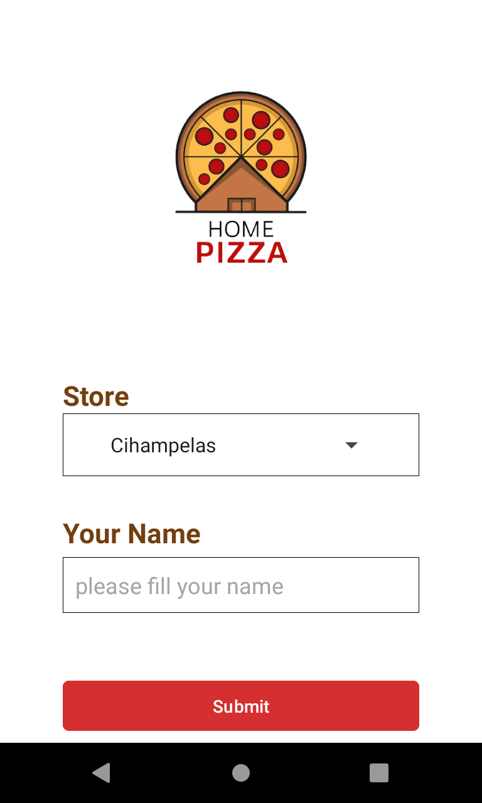
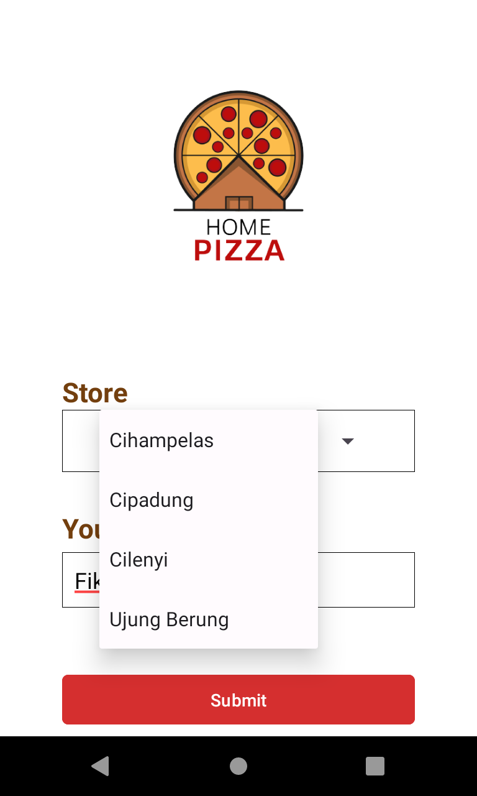
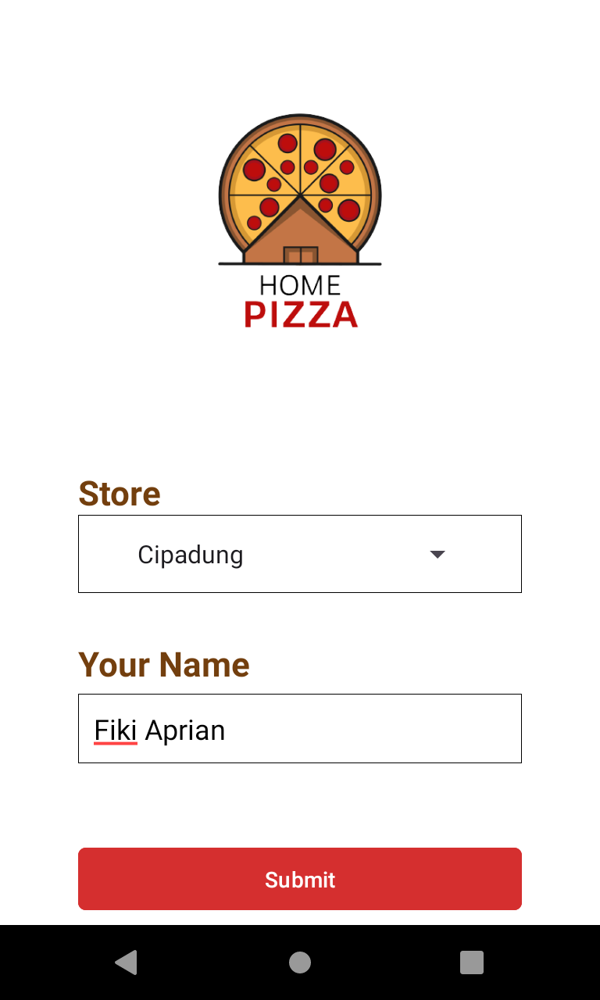
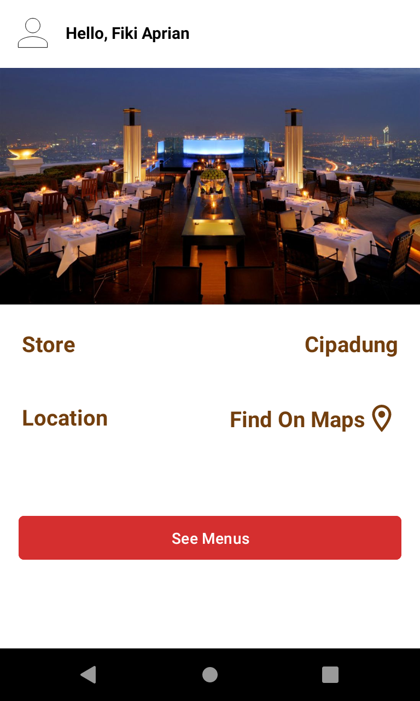
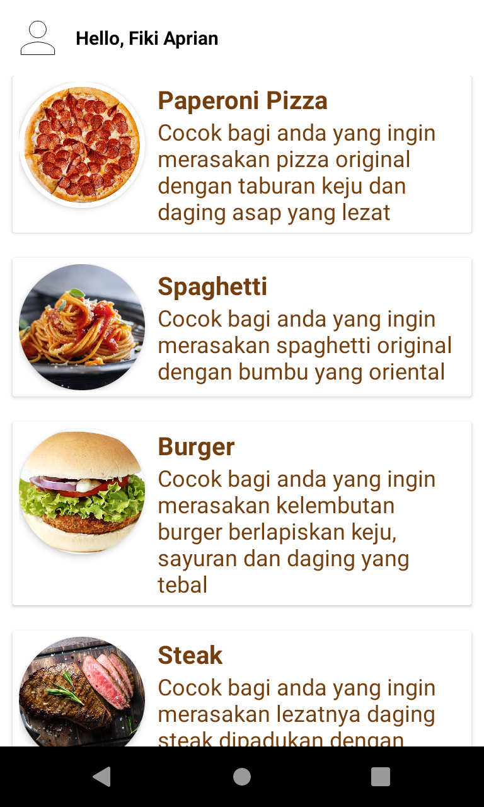
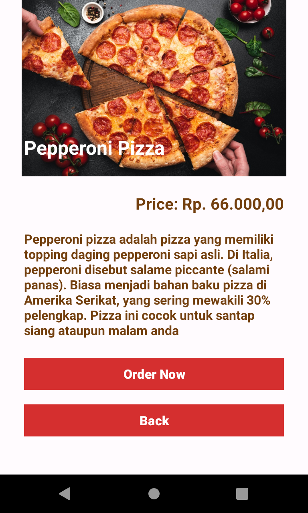
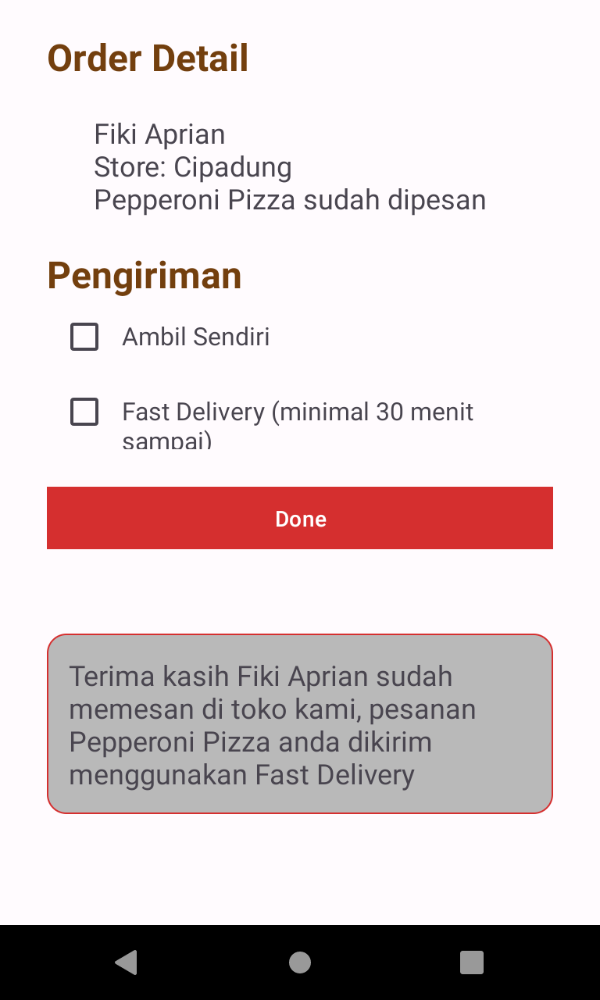

## UTS Prak PAW

**Nama**: Fiki Aprian

**NIM**: 1217050058

**Kelas**: Prak PAM B

### Deskripsi

Ini adalah repository untuk UTS Praktikum Pemrograman Aplikasi Mobile. Aplikasi yang dibuat adalah aplikasi pemesanan pizza. Repository ini berisi sourcode dan hasil dari proyek UTS yang dilakukan oleh Fiki Aprian.

### Screenshot Aplikasi

- **Form page**

- **Confirm Location page**

- **Menu Pizza page**

- **Pizza Detail page**

- **Order Detail page**

### Link Sourcode

Link sourcode : [https://github.com/fikiap23/UTS-PAM_Pizza.git](https://github.com/fikiap23/UTS-PAM_Pizza.git)

### Kontak

Jika Anda memiliki pertanyaan atau komentar, silakan hubungi Fiki Aprian melalui email di [fikiaprian23@gmail.com](mailto:fikiaprian23@gmail.com).

Terima kasih telah mengunjungi proyek UTS Prak PAM ini!
